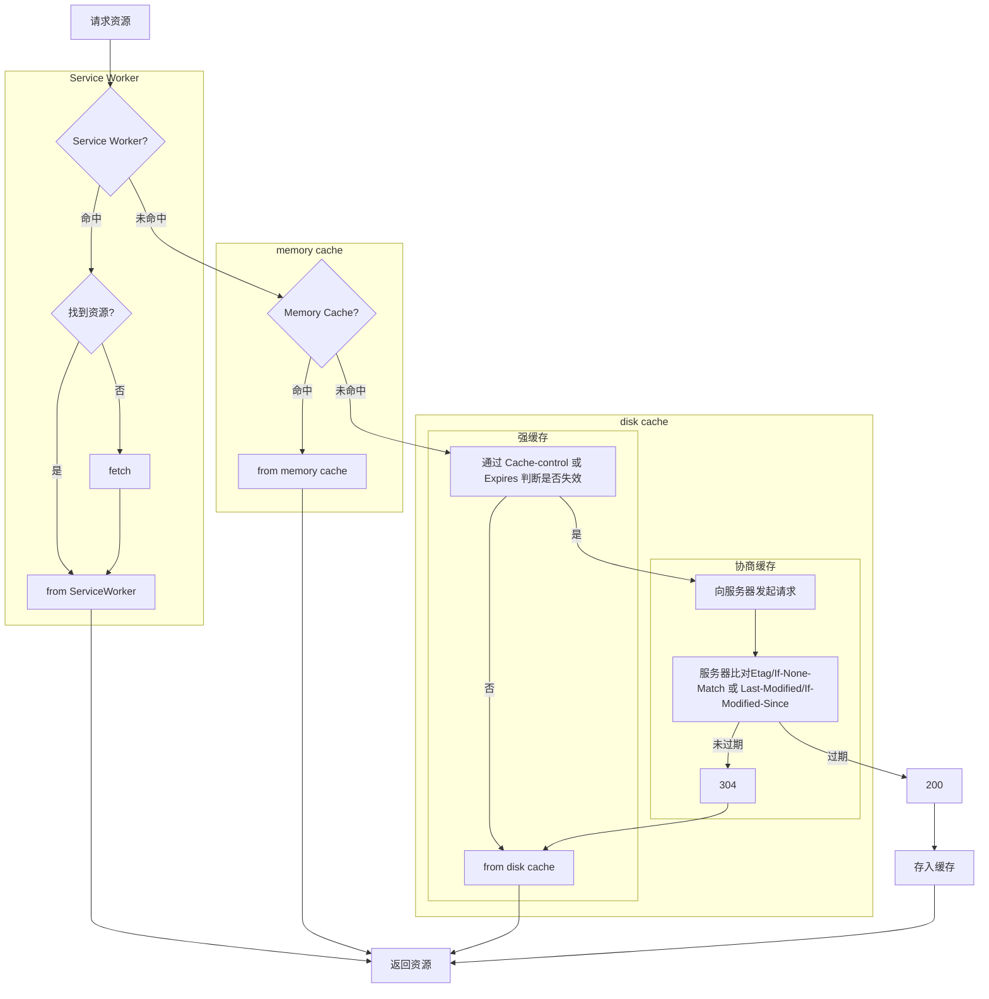

# 缓存

## 按缓存位置分

1. Service Worker
   - 有两种情况会导致这个缓存中的资源被清除：手动调用 API `cache.delete(resource)` 或者容量超过限制，被浏览器全部清空。
   - 如果 Service Worker 没能命中缓存，一般情况会使用 `fetch()` 方法继续获取资源。这时候，浏览器就去 memory cache 或者 disk cache 进行下一次找缓存的工作了。注意：经过 Service Worker 的 `fetch()` 方法获取的资源，即便它并没有命中 Service Worker 缓存，甚至实际走了网络请求，也会标注为 `from ServiceWorker`。
2. Memory Cache：tab关闭则失效

   - memory cache 机制保证了一个页面中如果有两个相同的请求 (例如两个 `src` 相同的 `image`，两个 `href` 相同的 `link`)都实际只会被请求最多一次，避免浪费。
   - 在从 memory cache 获取缓存内容时，浏览器会忽视例如 `max-age=0`, `no-cache` 等头部配置。例如页面上存在几个相同 `src` 的图片，即便它们可能被设置为不缓存，但依然会从 memory cache 中读取。这是因为 memory cache 只是短期使用，大部分情况生命周期只有一次浏览而已。而 `max-age=0` 在语义上普遍被解读为“不要在下次浏览时使用”，所以和 memory cache 并不冲突。
   - 但如果站长是真心不想让一个资源进入缓存，就连短期也不行，那就需要使用 `no-store`。存在这个头部配置的话，即便是 memory cache 也不会存储，自然也不会从中读取了。
3. Disk Cache
   - disk cache 会严格根据 HTTP 头信息中的各类字段来判定哪些资源可以缓存，哪些资源不可以缓存；哪些资源是仍然可用的，哪些资源是过时需要重新请求的。当命中缓存之后，浏览器会从硬盘中读取资源，虽然比起从内存中读取慢了一些，但比起网络请求还是快了不少的。**绝大部分的缓存都来自 disk cache**。
4. 网络请求
   - 如果一个请求在上述 3 个位置都没有找到缓存，那么浏览器会正式发送网络请求去获取内容。之后容易想到，为了提升之后请求的缓存命中率，自然要把这个资源添加到缓存中去。具体来说：
     1. 根据 Service Worker 中的 handler 决定是否存入 Cache Storage (额外的缓存位置)。
     2. 根据 HTTP 头部的相关字段(`Cache-control`, `Pragma` 等)决定是否存入 disk cache
     3. memory cache 保存一份资源 **的引用**，以备下次使用。

## 按失效策略分

memory cache 是浏览器为了加快读取缓存速度而进行的自身的优化行为，不受开发者控制，也不受 HTTP 协议头的约束，算是一个黑盒。Service Worker 是由开发者编写的额外的脚本，且缓存位置独立，出现也较晚，使用还不算太广泛。所以我们平时最为熟悉的其实是 **disk cache**，也叫 **HTTP cache** (因为不像 memory cache，它遵守 HTTP 协议头中的字段)。平时所说的**强制缓存（强缓存），对比缓存（协商缓存）**，以及 `Cache-Control` 等，也都归于此类。

### 强制缓存 (也叫强缓存)

**强制缓存直接减少请求数，是提升最大的缓存策略。** 它的优化覆盖了请求、处理、响应三个阶段

可以造成强制缓存的字段是 `Cache-control` 和 `Expires`。

- Expires：

  - HTTP1.0
  - 由于是绝对时间，用户可能会将客户端本地的时间进行修改，而导致浏览器判断缓存失效，重新请求该资源。此外，即使不考虑自信修改，时差或者误差等因素也可能造成客户端与服务端的时间不一致，致使缓存失效。
  - 写法太复杂了。表示时间的字符串多个空格，少个字母，都会导致非法属性从而设置失效

- Cache-control

  - HTTP1.1

  - 优先级高

  - `max-age`：即最大有效时间

    `must-revalidate`：如果超过了 `max-age` 的时间，浏览器必须向服务器发送请求，验证资源是否还有效。

    `no-cache`：虽然字面意思是“不要缓存”，但实际上还是要求客户端缓存内容的，只是是否使用这个内容由后续的对比来决定。

    `no-store`: 真正意义上的“不要缓存”。所有内容都不走缓存，包括强制和对比。

    `public`：所有的内容都可以被缓存 (包括客户端和代理服务器， 如 CDN)

    `private`：所有的内容只有客户端才可以缓存，代理服务器不能缓存。默认值。

    

### 对比缓存 (协商缓存)

**对比缓存在请求数上和没有缓存是一致的**，但如果是 304 的话，返回的仅仅是一个状态码而已，并没有实际的文件内容，因此 **在响应体体积上的节省是它的优化点**。

- Last-Modified & If-Modified-Since
  - 服务器通过 `Last-Modified` 字段告知客户端，资源最后一次被修改的时间
  - 浏览器将这个值和内容一起记录在缓存数据库中。
  - 下一次请求相同资源时时，浏览器从自己的缓存中找出“不确定是否过期的”缓存。因此在请求头中将上次的 `Last-Modified` 的值写入到请求头的 `If-Modified-Since` 字段
  - 服务器会将 `If-Modified-Since` 的值与 `Last-Modified` 字段进行对比。如果相等，则表示未修改，响应 304；反之，则表示修改了，响应 200 状态码，并返回数据。
  - 如果资源更新的速度是秒以下单位，那么该缓存是不能被使用的，因为它的时间单位最低是秒。
  - 如果文件是通过服务器动态生成的，那么该方法的更新时间永远是生成的时间，尽管文件可能没有变化，所以起不到缓存的作用。
- Etag & If-None-Match
  - **Etag 的优先级高于 Last-Modified**
  - `Etag` 存储的是文件的特殊标识(一般都是 hash 生成的)，服务器存储着文件的 `Etag` 字段。
  - 之后的流程和 `Last-Modified` 一致，只是 `Last-Modified` 字段和它所表示的更新时间改变成了 `Etag` 字段和它所表示的文件 hash，把 `If-Modified-Since` 变成了 `If-None-Match`。
  - 服务器同样进行比较，命中返回 304, 不命中返回新资源和 200。

## Ajax 解决浏览器缓存问题

在ajax发送请求前加上 anyAjaxObj.setRequestHeader("If-Modified-Since","0")。

在ajax发送请求前加上 anyAjaxObj.setRequestHeader("Cache-Control","no-cache")。

在URL后面加上一个随机数： "fresh=" + Math.random()。

在URL后面加上时间搓："nowtime=" + new Date().getTime()。

如果是使用jQuery，直接这样就可以了 $.ajaxSetup({cache:false})。这样页面的所有ajax都会执行这条语句就是不需要保存缓存记录。