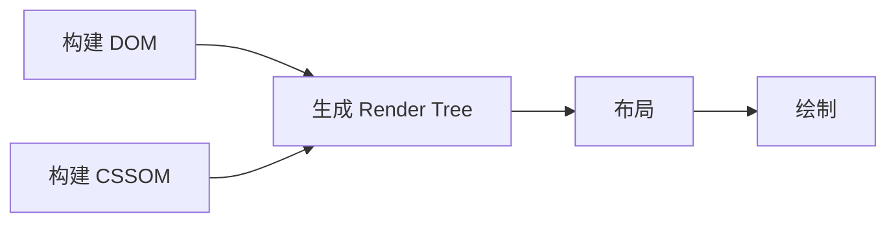
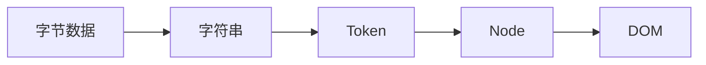

# 浏览器渲染原理



## 构建 DOM（CSSOM同理）



## Render Tree

- 不显示（`display: none`）的元素不会被生成
- 有了`RenderTree`，我们就知道了所有节点的样式，然后计算他们在页面上的大小和位置（布局），最后把节点绘制到页面上（绘制）。
- 由于浏览器使用流式布局，对`Render Tree`的计算通常只需要遍历一次就可以完成，**但`table`及其内部元素除外，他们可能需要多次计算，通常要花3倍于同等元素的时间，这也是为什么要避免使用`table`布局的原因之一**。

### 重绘

由于节点的几何属性发生改变或者由于样式发生改变而不会影响布局的，称为重绘，例如`outline`, `visibility`, `color`、`background-color`等，重绘的代价是高昂的，因为浏览器必须验证DOM树上其他节点元素的可见性。

### 回流

回流是布局或者几何属性需要改变就称为回流。回流是影响浏览器性能的关键因素，因为其变化涉及到部分页面（或是整个页面）的布局更新。一个元素的回流可能会导致了其所有子元素以及DOM中紧随其后的节点、祖先节点元素的随后的回流。


## 浏览器优化

现代浏览器大多都是通过队列机制来批量更新布局，浏览器会把修改操作放在队列中，至少一个浏览器刷新（即16.6ms）才会清空队列，但当你**获取布局信息的时候，队列中可能有会影响这些属性或方法返回值的操作，即使没有，浏览器也会强制清空队列，触发回流与重绘来确保返回正确的值**。

主要包括以下属性或方法：

- `offsetTop`、`offsetLeft`、`offsetWidth`、`offsetHeight`
- `scrollTop`、`scrollLeft`、`scrollWidth`、`scrollHeight`
- `clientTop`、`clientLeft`、`clientWidth`、`clientHeight`
- `width`、`height`
- `getComputedStyle()`
- `getBoundingClientRect()`

所以，我们应该避免频繁的使用上述的属性，他们都会强制渲染刷新队列。

#### 减少重绘与回流

1. CSS

   - **使用 `transform` 替代 `top`**

   - **使用 `visibility` 替换 `display: none`** ，因为前者只会引起重绘，后者会引发回流（改变了布局

   - **避免使用`table`布局**，可能很小的一个小改动会造成整个 `table` 的重新布局。

   - **尽可能在`DOM`树的最末端改变`class`**，回流是不可避免的，但可以减少其影响。尽可能在DOM树的最末端改变class，可以限制了回流的范围，使其影响尽可能少的节点。

   - **避免设置多层内联样式**，CSS 选择符**从右往左**匹配查找，避免节点层级过多。

     ```html
     <div>
       <a> <span></span> </a>
     </div>
     <style>
       span {
         color: red;
       }
       div > a > span {
         color: red;
       }
     </style>
     ```

     对于第一种设置样式的方式来说，浏览器只需要找到页面中所有的 `span` 标签然后设置颜色，但是对于第二种设置样式的方式来说，浏览器首先需要找到所有的 `span` 标签，然后找到 `span` 标签上的 `a` 标签，最后再去找到 `div` 标签，然后给符合这种条件的 `span` 标签设置颜色，这样的递归过程就很复杂。所以我们应该尽可能的避免写**过于具体**的 CSS 选择器，然后对于 HTML 来说也尽量少的添加无意义标签，保证**层级扁平**。

   - **将动画效果应用到`position`属性为`absolute`或`fixed`的元素上**，避免影响其他元素的布局，这样只是一个重绘，而不是回流，同时，控制动画速度可以选择 `requestAnimationFrame`，详见[探讨 requestAnimationFrame](https://github.com/LuNaHaiJiao/blog/issues/30)。

   - **避免使用`CSS`表达式**，可能会引发回流。

   - **将频繁重绘或者回流的节点设置为图层**，图层能够阻止该节点的渲染行为影响别的节点，例如`will-change`、`video`、`iframe`等标签，浏览器会自动将该节点变为图层。

   - **CSS3 硬件加速（GPU加速）**，使用css3硬件加速，可以让`transform`、`opacity`、`filters`这些动画不会引起回流重绘 。但是对于动画的其它属性，比如`background-color`这些，还是会引起回流重绘的，不过它还是可以提升这些动画的性能。

2. JavaScript

   - **避免频繁操作样式**，最好一次性重写`style`属性，或者将样式列表定义为`class`并一次性更改`class`属性。
   - **避免频繁操作`DOM`**，创建一个`documentFragment`，在它上面应用所有`DOM操作`，最后再把它添加到文档中。
   - **避免频繁读取会引发回流/重绘的属性**，如果确实需要多次使用，就用一个变量缓存起来。
   - **对具有复杂动画的元素使用绝对定位**，使它脱离文档流，否则会引起父元素及后续元素频繁回流。

## JS 什么时候解析？

1. `<script>`

   - 渲染过程中，如果遇到 JS 就停止渲染，执行 JS 代码。

   - 如果 JS 需要操作CSSOM，则会先让CSSOM构建完，再执行JS，最后构建DOM
2. `<script async>`
   - 异步执行引入的 JavaScript，加载完成后就执行 JS，阻塞DOM
3. `<script defer>`
   - 延迟执行。**载入 JavaScript 文件时不阻塞 HTML 的解析，执行阶段被放到 HTML 标签解析完成之后。**