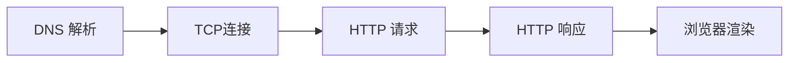

# 计算机网络

## TCP 三次握手

第一次握手：起初两端都处于CLOSED关闭状态，Client将标志位SYN置为1，随机产生一个值seq=x，并将该数据包发送给Server，Client进入SYN-SENT状态，等待Server确认；

第二次握手：Server收到数据包后由标志位SYN=1得知Client请求建立连接，Server将标志位SYN和ACK都置为1，ack=x+1，随机产生一个值seq=y，并将该数据包发送给Client以确认连接请求，Server进入SYN-RCVD状态，此时操作系统为该TCP连接分配TCP缓存和变量；

第三次握手：Client收到确认后，检查ack是否为x+1，ACK是否为1，如果正确则将标志位ACK置为1，ack=y+1，并且此时操作系统为该TCP连接分配TCP缓存和变量，并将该数据包发送给Server，Server检查ack是否为y+1，ACK是否为1，如果正确则连接建立成功，Client和Server进入ESTABLISHED状态，完成三次握手，随后Client和Server就可以开始传输数据。

## CDN 原理

CDN的全称是Content Delivery Network，即内容分发网络。CDN的基本原理是广泛采用各种缓存服务器，将这些缓存服务器分布到用户访问相对集中的地区或网络中，在用户访问网站时，利用全局负载技术将用户的访问指向距离最近的工作正常的缓存服务器上，由缓存服务器直接响应

## 从输入url到显示页面这个过程发生了什么

### DNS 解析

- 浏览器缓存：浏览器会按照一定的频率缓存 DNS 记录。
- 操作系统缓存：如果浏览器缓存中找不到需要的 DNS 记录，那就去操作系统中找。
- 路由缓存：路由器也有 DNS 缓存。
- ISP 的 DNS 服务器：ISP 是互联网服务提供商(Internet Service Provider)的简称，ISP 有专门的 DNS 服务器应对 DNS 查询请求。
- 根服务器：ISP 的 DNS 服务器还找不到的话，它就会向根服务器发出请求，进行递归查询（DNS 服务器先问根域名服务器.com 域名服务器的 IP 地址，然后再问.baidu 域名服务器，依次类推）

## OSI 七层模型

应用层：文件传输，常用协议HTTP，snmp,FTP ,

表示层：数据格式化，代码转换，数据加密，

会话层：建立，解除会话

传输层：提供端对端的接口，tcp,udp

网络层：为数据包选择路由，IP，icmp

数据链路层：传输有地址的帧

物理层：二进制的数据形式在物理媒体上传输数据

## TCP和UDP的区别

### UDP

1. 无连接
2. 面向报文，只是报文的搬运工
3. 不可靠，没有拥塞控制
4. 高效，头部开销只有8字节
5. 支持一对一、一对多、多对多、多对一
6. 适合直播、视频、语音、会议等实时性要求高的

### TCP

1. 面向连接：传输前需要先连接
2. 可靠的传输
3. 流量控制：发送方不会发送速度过快，超过接收方的处理能力
4. 拥塞控制：当网络负载过多时能限制发送方的发送速率
5. 不提供时延保障
6. 不提供最小带宽保障

## 为什么三次握手四次挥手

- 四次挥手
  - 因为是双方彼此都建立了连接，因此双方都要释放自己的连接，A向B发出一个释放连接请求，他要释放链接表明不再向B发送数据了，此时B收到了A发送的释放链接请求之后，给A发送一个确认，A不能再向B发送数据了，它处于FIN-WAIT-2的状态，但是此时B还可以向A进行数据的传送。此时B向A 发送一个断开连接的请求，A收到之后给B发送一个确认。此时B关闭连接。A也关闭连接。
  - 为什么要有TIME-WAIT这个状态呢，这是因为有可能最后一次确认丢失，如果B此时继续向A发送一个我要断开连接的请求等待A发送确认，但此时A已经关闭连接了，那么B永远也关不掉了，所以我们要有TIME-WAIT这个状态。
  - 当然TCP也并不是100%可靠的。
- 三次握手
  - **为了防止已失效的连接请求报文段突然又传送到了服务端，因而产生错误**

## websocket和ajax的区别是什么，websocket的应用场景有哪些

WebSocket的诞生本质上就是为了解决HTTP协议本身的单向性问题：请求必须由客户端向服务端发起，然后服务端进行响应。这个Request-Response的关系是无法改变的。对于一般的网页浏览和访问当然没问题，一旦我们需要服务端主动向客户端发送消息时就麻烦了，因为此前的TCP连接已经释放，根本找不到客户端在哪。
为了能及时从服务器获取数据，程序员们煞费苦心研究出来的各种解决方案其实都是在HTTP框架下做的妥协，没法子，浏览器这东西只支持HTTP，我们有什么办法。所以大家要么定时去轮询，要么就靠长连接——客户端发起请求，服务端把这个连接攥在手里不回复，等有消息了再回，如果超时了客户端就再请求一次——其实大家也懂，这只是个减少了请求次数、实时性更好的轮询，本质没变。

WebSocket就是从技术根本上解决这个问题的：看名字就知道，它借用了Web的端口和消息头来创建连接，后续的数据传输又和基于TCP的Socket几乎完全一样，但封装了好多原本在Socket开发时需要我们手动去做的功能。比如原生支持wss安全访问（跟https共用端口和证书）、创建连接时的校验、从数据帧中自动拆分消息包等等。

换句话说，原本我们在浏览器里只能使用HTTP协议，现在有了Socket，还是个更好用的Socket。

了解了WebSocket的背景和特性之后，就可以回答它能不能取代AJAX这个问题了：

对于服务器与客户端的双向通信，WebSocket简直是不二之选。如果不是还有少数旧版浏览器尚在服役的话，所有的轮询、长连接等方式早就该废弃掉。那些整合多种双向推送消息方式的库（如http://Socket.IO、SignalR）当初最大的卖点就是兼容所有浏览器版本，自动识别旧版浏览器并采取不同的连接方式，现在也渐渐失去了优势——所有新版浏览器都兼容WebSocket，直接用原生的就行了。

说句题外话，这点很像jQuery，在原生js难用时迅速崛起，当其他库和原生js都吸收了它的很多优势时，慢慢就不那么重要了。

但是，很大一部分AJAX的使用场景仍然是传统的请求-响应形式，比如获取json数据、post表单之类。这些功能虽然靠WebSocket也能实现，但就像在原本传输数据流的TCP之上定义了基于请求的HTTP协议一样，我们也要在WebSocket之上重新定义一种新的协议，最少也要加个request id用来区分每次响应数据对应的请求吧。

……但是，何苦一层叠一层地造个新轮子呢？直接使用AJAX不是更简单、更成熟吗？

另外还有一种情况，也就是传输大文件、图片、媒体流的时候，最好还是老老实实用HTTP来传。如果一定要用WebSocket的话，至少也专门为这些数据专门开辟个新通道，而别去占用那条用于推送消息、对实时性要求很强的连接。否则会把串行的WebSocket彻底堵死的。

所以说，WebSocket在用于双向传输、推送消息方面能够做到灵活、简便、高效，但在普通的Request-Response过程中并没有太大用武之地，比起普通的HTTP请求来反倒麻烦了许多，甚至更为低效。

每项技术都有自身的优缺点，在适合它的地方能发挥出最大长处，而看到它的几个优点就不分场合地全方位推广的话，可能会适得其反。

我们自己在开发能与手机通信的互联网机器人时就使用了WebSocket，效果很好。但并不是用它取代HTTP，而是取代了原先用于通信的基于TCP的Socket。

优点是：

原先在Socket连接后还要进行一些复杂的身份验证，同时要阻止未验证的连接发送控制指令。现在不需要了，在建立WebSocket连接的url里就能携带身份验证参数，验证不通过可以直接拒绝，不用设置状态；

原先自己实现了一套类似SSL的非对称加密机制，现在完全不需要了，直接通过wss加密，还能顺便保证证书的可信性；

原先要自己定义Socket数据格式，设置长度与标志，处理粘包、分包等问题，现在WebSocket收到的直接就是完整的数据包，完全不用自己处理；

前端的nginx可以直接进行转发与负载均衡，部署简单多了

## TCP/IP的网络模型

TCP/IP模型是一系列网络协议的总称，这些协议的目的是使得计算机之间可以进行信息交换，

TCP/IP模型四层架构从下到上分别是链路层，网络层，传输层，应用层

链路层的作用是负责建立电路连接，是整个网络的物理基础，典型的协议包括以太网，ADSL等，

网络层负责分配地址和传送二进制数据，主要协议是IP协议，

传输层负责传送文本数据，主要协议是TCP

应用层负责传送各种最终形态的数据，是直接与用户信息打交道的层，主要协议是http，ftp等

