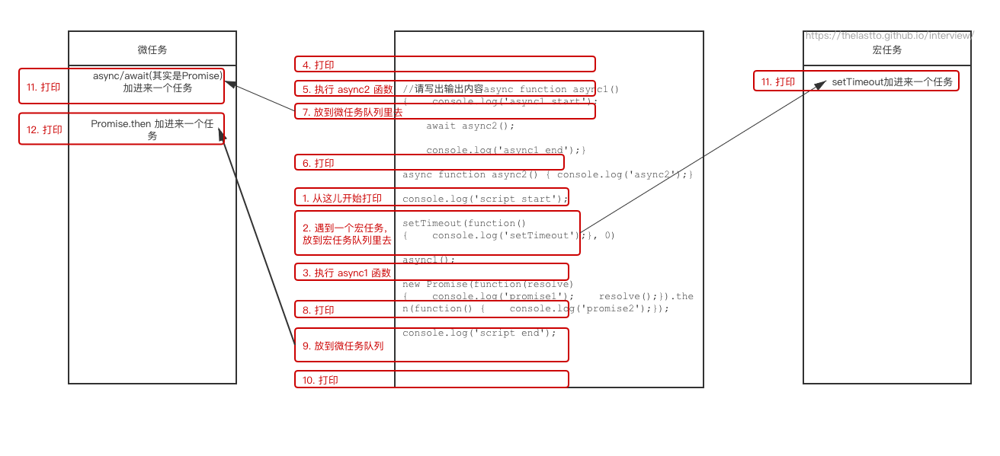

# 事件循环

这个面试题我到处都能看到，所以一定要能讲清楚呀！

完全不知道的可以先看一下这里，我觉得还蛮清楚的：https://github.com/Advanced-Frontend/Daily-Interview-Question/issues/7

实在不想点进去的我就划一下重点：


下面我仅用我自己的理解来解释一下：

1. 首先我们按顺序执行 script，这个永远是第一个宏任务。就叫宏任务1好了。

2. 期间万一遇到 `setTimeout`、`setInterval`、I/O、UI 交互事件、`postMessage`、`MessageChannel`、`setImmediate(Node.js 环境)`，我们先把他们存起来。存到哪里呢？存到下一个宏任务队列（宏任务2）里面。

3. 期间万一遇到 `Promise.then`、`MutaionObserver`、`process.nextTick(Node.js 环境)`，我们也把他们存起来，这回我们存到微任务队列（微任务1）里面。

4. 执行完 script 中的代码了，接下来我们看看微任务1里面有啥要执行的就先执行完。

5. 接下来就是重新渲染

6. 渲染完又可以开启新一轮循环了，开始执行宏任务2

7. 所以整体的执行顺序就是

   > 宏任务1 --> 微任务1 --> 宏任务2 --> 微任务2 --> ...


## await

我们上面没有讲到 async/await

其实可以把 await 后面的代码看成一个微任务，因为它本身就是 Promise 的语法糖嘛

> **实际上await是一个让出线程的标志。await后面的表达式会先执行一遍，将await后面的代码加入到microtask中，然后就会跳出整个async函数来执行后面的代码。**

例如：

```js
async function async1() {
	console.log('async1 start');
	await async2();
	console.log('async1 end');
}
```

等价于

```js
async function async1() {
	console.log('async1 start');
	Promise.resolve(async2()).then(() => {
    console.log('async1 end');
  })
}
```


下面我放一下习题，都能答对的话应该就算理解啦～

## 习题

```js
//请写出输出内容
async function async1() {
    console.log('async1 start');
    await async2();
    console.log('async1 end');
}
async function async2() {
	console.log('async2');
}

console.log('script start');

setTimeout(function() {
    console.log('setTimeout');
}, 0)

async1();

new Promise(function(resolve) {
    console.log('promise1');
    resolve();
}).then(function() {
    console.log('promise2');
});
console.log('script end');


/*
script start
async1 start
async2
promise1
script end
async1 end
promise2
setTimeout
*/
```

